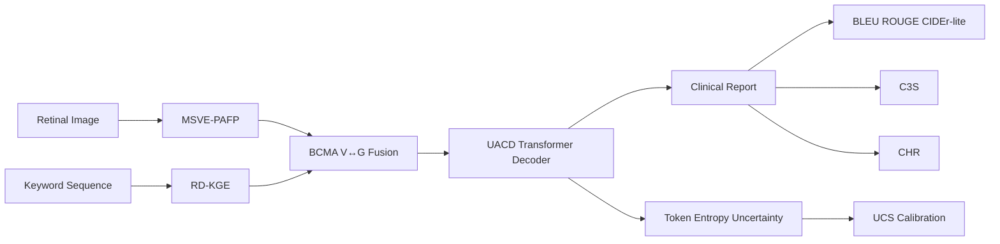

# GRACE Architecture (Implemented)

## Module-to-File Map

- MSVE-PAFP: `grace/models/msve_pafp.py`
- RD-KGE: `grace/models/rdkge.py`
- BCMA: `grace/models/bcma.py`
- UACD: `grace/models/decoder.py`
- End-to-end model: `grace/models/grace_model.py`
- Composite losses: `grace/losses.py`
- Metrics: `grace/metrics.py`
- Training + evaluation + figures: `grace/train.py`
